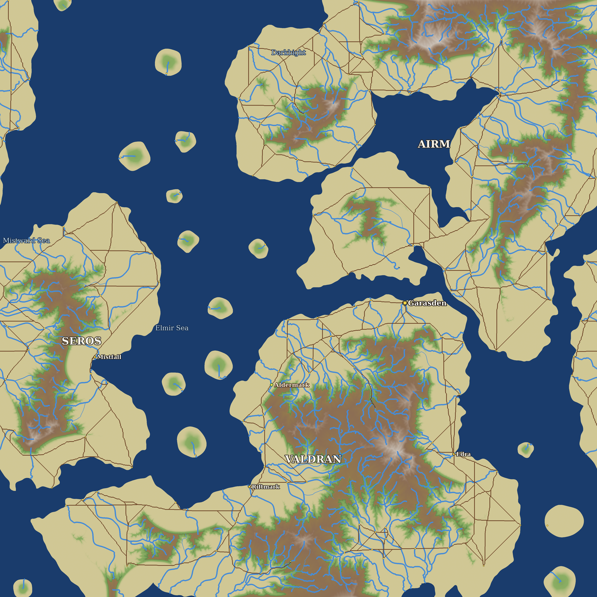

# OnlineRPG 세계관 설정

이 문서는 OnlineRPG의 세계관 기준 문서다.  
게임 시스템 확장 시, 설정 충돌을 줄이기 위한 공통 기준으로 사용한다.

## 1. 세계 개요

- 세계 이름: `두루나 (Dulunar)`
- 장르 톤: 중세 판타지 + 고대 기술 유적
- 핵심 테마:
  - 생존
  - 탐험
  - 사냥
  - 발굴
  - 생활

두루나는 사람들이 중세 수준의 기술로 살아가는 세계다.
현재의 주민 대부분은 발 아래 잠든 고대 문명의 존재를 알지 못한다.
지하 깊은 곳에는 붕괴한 문명의 유적과 구조물이 남아 있으며, 때로 발굴되는 유물은 마법으로 여겨진다.
유적에서 흘러나오는 에너지의 영향으로 일부 생명체가 변이했다.

## 2. 시대와 현재 상황

- 기준 시기: `가라스 기원 217년`
- 역사 배경: 흩어진 부족들을 통일한 왕 `가라스 (Garath)`가 왕국을 세운 해를 원년으로 삼는다.
- 현재 상태:
  - 주요 정착지는 방어 가능한 소규모 거점 중심
  - 거점 밖은 몬스터 출몰이 잦아 상시 위험 지역
  - 유적 발굴과 자원 확보를 둘러싸고 세력 간 긴장 지속

## 3. 시간 설정

- 표준 시간 체계: `두루나 표준시(AST)`
- 게임 내 1일 길이: `3시간(현실 시간)`
- 천체 설정:
  - 두루나의 밤하늘에는 `큰 달`과 `작은 달` 두 개가 존재한다.
  - `큰 달`: `엘도르 (Eldor)` / 영어 별칭 `Elder` / 한글 별칭 `맏달`
  - `작은 달`: `세린 (Serin)` / 영어 별칭 `Swift` / 한글 별칭 `샛달`
- 달력 체계:
  - 1달 = `30일`
  - 1년 = `12달`
  - 1년 = `360일`
- 월/달 주기 기준:
  - `큰 달 공전 주기`: `30일` (달력의 1달 기준)
  - `작은 달 공전 주기`: `20일`
  - `두 달 상대 배치 반복 주기`: `60일` (30과 20의 최소공배수)
  - `큰 달 위상 기준`: `1일 삭`, `15일 만월`
  - `작은 달 위상 기준`: `1일 삭`, `10일 만월`
  - `위상 오프셋 기준`: 작은 달은 큰 달 대비 `+5일` 오프셋으로 시작한다.
- 월 이름(1월~12월):
  - `Dawnmere`: 새벽의 고요
  - `Reson`: 공명의 시기
  - `Verdant`: 생장이 무성한 시기
  - `Highsun`: 태양이 가장 높은 시기
  - `Emberfall`: 불씨가 식어가는 시기
  - `Redrain`: 붉은 비의 시기
  - `Harvestwind`: 수확 바람의 시기
  - `Gloam`: 황혼이 길어지는 시기
  - `Riftwane`: 균열의 기세가 약해지는 시기
  - `Mistveil`: 안개 장막의 시기
  - `Frostrest`: 서리와 휴식의 시기
  - `Afterglow`: 잔광이 남는 시기
- 기준 시각: `12:00`에서 시작
- 일출/일몰 기준: `춘분/추분` 기준 `06:00` 일출 / `18:00` 일몰 (낮 12시간)
  - 실제 일출·일몰 시각은 고정값이 아니라 아래 위도 40도권 모델(태양 적위 기반)로 날짜마다 계산된다. 서버·클라이언트가 동일 산식을 사용한다.
- 계절 기준일(360일력, 90일 간격):
  - `동지`: 12월 30일
  - `춘분`: 3월 30일
  - `하지`: 6월 30일
  - `추분`: 9월 30일
- 태양 고도/일장 기준(위도 40도권 기준):
  - `춘분 정오 태양 고도`: 약 50도
  - `하지 정오 태양 고도`: 약 74도 (춘분 대비 +24도)
  - `동지 정오 태양 고도`: 약 26도 (춘분 대비 -24도)
  - `하지-동지 낮 길이 차`: 약 5시간 45분
- 시간 동기화 원칙:
  - 서버가 권한 시간을 계산한다.
  - 서버는 약 `8초`마다 현재 시각을 브로드캐스트한다.
  - 클라이언트는 수신한 시각으로 태양/조명을 재동기화한다.

세계관적으로 두루나의 낮과 밤은 유적 에너지의 간섭으로 짧은 주기로 순환한다.  
현장 인원은 일반 달력 시간과 별도로 AST를 사용해 임무를 기록한다.

디버깅용 빠른 시간 배율(예: FAST SUN)은 개발 편의를 위한 비설정 기능으로 취급한다.

## 4. 세계 지도

### 대륙

| 이름 | 설명 |
|---|---|
| `발드란 (Valdran)` | 주 대륙. 가라스 왕국의 중심지 |
| `세로스 (Seros)` | 서쪽 대륙. 미지의 영역 |
| `아이름 (Airm)` | 북쪽 험준한 대륙 |

### 주요 도시

| 이름 | 설명 |
|---|---|
| `가라스텐 (Garasden)` | 수도. 가라스 왕이 세운 왕국의 중심 |
| `에드라 (Edra)` | 정통 무역 항구. 상인과 귀족 중심, 여러 세력의 교역 거점 |
| `리프트마크 (Riftmark)` | 모험가와 발굴단이 모이는 거친 항구. 지하 유적 접근이 쉬운 위치로 발굴품 거래로 유명 |
| `미스트폴 (Mistfall)` | 서쪽 안개 지역 도시 |

### 강

| 이름 | 설명 |
|---|---|
| `발드런 강 (Valdrun)` | 발드란 대륙의 주요 강 |
| `세린 강 (Serinrun)` | 작은 달 세린의 이름을 딴 강 |
| `붉은 강 (Redrun)` | 붉은 협곡을 흐르는 강 |

### 바다

| 이름 | 설명 |
|---|---|
| `엘미르 해 (Elmir Sea)` | 발드란과 세로스 사이 |
| `안개 해 (Mistward Sea)` | 서쪽 짙은 안개 바다 |
| `흑해만 (Darkbight)` | 북쪽 위험한 만 |

### 섬

| 이름 | 설명 |
|---|---|
| `엘도르 섬 (Eldorisle)` | 큰 달 이름을 딴 섬 |
| `연기 섬 (Ashisle)` | 화산 섬 |
| `안개 섬 (Mistisle)` | 안개 속 섬 |

## 5. 지역 구성

- `회색 평원`: 초보 개척 구역, 기본 자원과 저위험 몬스터 분포
  - `앨더마크 (Aldermark)`: 회색 평원의 시작 마을이자 플레이어 스폰/부활 거점. 몬스터가 차단된 안전지대(no-spawn)이며, 경비병 `카를 (Karl)`과 상인 `리카 (Rica)`가 상주한다. (스폰 좌표 약 `x=-1475, z=4742`)
- `붉은 협곡`: 시야가 좁고 기습이 잦은 전투 중심 구역
- `침식 숲`: 변이 생물 출몰 비율이 높은 구역
- `균열 지대`: 고위험 고보상 지역, 고대 장치 흔적이 다수 존재

## 6. 주요 세력

- `가라스 기사단`: 왕의 친위 기사단. 왕국의 치안 유지와 왕실 보호 담당
- `가라스의 눈 (Eye of Garath)`: 공식 명칭은 `왕실 유산청`. 발굴 유물을 왕실 재산으로 등록한다는 명목으로 운영되나, 실질적으로는 왕가의 사익을 위해 움직이는 부패 기관. 총감은 대대로 국왕의 정부가 맡아온 관례. 무장 경호대를 보유하며, 유적 관리국과 유물 주도권을 두고 경쟁한다
- `유적 관리국`: 국가 공인 유적 관리 기관. 고대 기술 회수/봉인 전담, 정보 독점 성향. 왕가 직속인 가라스의 눈을 견제하며 유물 주도권을 지키려 한다
- `프리블레이드 (Freeblade)`: 가라스 대왕의 통일 전쟁을 도운 대가로 왕국 내 특별한 자유를 보장받은 용병단. 법적으로 왕국 어느 세력의 지휘도 받지 않으며, 가라스 기사단만으로 해결하기 어려운 임무에 협조한다. 어느 편도 아니지만 어디에나 나타난다.

## 7. 주요 인물

### 알드렌 2세 (Aldren II) — 현 국왕

- **나이**: 46세
- **가라스로부터**: 8대손
- **외모**: 가라스 왕가 특유의 진한 회색 눈동자, 검은 머리카락에 흰 줄기가 섞이기 시작함. 건장한 체격이지만 오랜 통치의 피로가 얼굴에 역력하다.
- **가족**:
  - 왕비 `이사벨 (Isabel)` — 에드라 항구 귀족 가문 출신
  - 왕세자 `레드릭 (Ledric)`, 21세
  - 왕녀 `세리나 (Serina)`, 14세 — 작은 달 세린의 이름에서 유래

### 코르반 (Corvan) — 가라스 기사단 단장

- **나이**: 52세
- **외모**: 장신에 다부진 체격, 짧게 자른 회색 머리, 왼쪽 눈 위로 오래된 검상(劍傷). 공식 석상에서는 항상 갑옷을 완전히 착용한다.
- **성격**: 극도로 규율적이며 왕실에 대한 충성이 절대적. 감정 표현이 적고 냉정하지만 부하들 사이에서는 공정한 지휘관으로 신뢰받는다. 프리블레이드의 공화주의 성향을 경계한다.
- **가족**:
  - 아내 `엘린 (Elin)` — 15년 전 병으로 사망
  - 아들 `레인 (Rein)`, 24세 — 기사단 하급 기사로 복무 중

### 에스린 (Esrin) — 왕실 유산청 총감, 국왕의 정부

- **나이**: 38세
- **성격**: 왕의 총애를 권력 기반으로 삼으면서도 스스로의 야심이 있다. 전임자에게 철저히 훈련받아 행정과 협상에 능하며, 감정을 전략적으로 사용한다.
- **상징**: 왕비가 큰 달(맏달)이라면, 에스린은 작은 달(샛달). 빠르고 은밀하게 움직이는 존재. 왕국 귀족들은 그 관계를 알면서도 공식적으로 입에 올리지 않는다.
- **관례**: 왕실 유산청 총감 자리는 대대로 국왕의 정부가 맡아온 비공식 관례. 후임은 전임자가 왕에게 추천하는 방식으로 이어져 내려온다. 에스린 역시 선대 국왕의 정부였던 전임자에게서 역할을 물려받았다.
- **가족**:
  - 왕과의 사이에 사생아 아들 `세드릭 (Cedric)`, 12세 — 존재가 반공식적으로 알려져 있음

### 발렌트 (Valent) — 유적 관리국장

- **나이**: 61세
- **성격**: 학자 출신으로 고대 문명의 위험성을 누구보다 잘 안다고 믿는다. 유물이 무분별하게 유통되는 것을 극도로 경계하며, 제도와 규정을 방패 삼아 움직인다. 표면적으로는 왕에게 충성하지만 실제로는 왕보다 "관리국의 사명"을 우선시한다. 에스린을 왕국에서 가장 위험한 인물로 여긴다.
- **가족**:
  - 아내 `에린 (Erin)` — 왕실 역사학자 출신
  - 딸 `발린 (Valin)`, 30세 — 관리국 소속 유적 연구원

### 타렌 (Taren) — 프리블레이드 대장

- **나이**: 43세
- **외모**: 단정하고 평범한 인상. 특별히 눈에 띄지 않지만, 한번 눈이 마주치면 쉽게 잊히지 않는 눈빛
- **성격**: 항상 협조적이고 예의 바르다. 그러나 그 이면의 의도를 읽기 어렵다. 왕국에 대한 충성인지 이익 계산인지, 아니면 전혀 다른 목적이 있는 것인지 누구도 확신하지 못한다. 코르반조차 그를 완전히 신뢰하지는 않는다.
- **가족**:
  - 알려진 가족 없음. 과거에 대해 스스로 거의 말하지 않는다.

### 카를 (Karl) — 앨더마크 경비병

- **나이**: 32세
- **외모**: 다부진 체격에 볕에 그을린 얼굴, 한쪽 다리에 옛 부상의 흔적이 남아 걸음이 살짝 무겁다. 낡았지만 늘 손질된 병사 시절의 장비를 착용한다.
- **성격**: 엄정하지만 공정하다. 말수가 적고 의무에 충실하며, 이따금 건조한 농담을 던진다.
- **배경**: 왕국군 병사로 변경에서 복무하다 부상을 입고 일선에서 물러나 앨더마크의 경비를 맡았다. 거점을 안전하게 지키는 일에 자부심을 느낀다. 마을을 지키는 강한 전사는 존중하고 수상한 외지인은 경계하지만, 길 잃은 풋내기 모험가에게는 은근히 마음이 약하다.

### 리카 (Rica) — 앨더마크 상인

- **나이**: 38세
- **외모**: 눈매가 반짝이는 중년 여인. 편한 차림새로 갖가지 물건이 늘어선 가게를 지킨다.
- **성격**: 쾌활하고 약삭빠르며 늘 거래거리를 찾는다. 소문이라면 사족을 못 쓴다.
- **배경**: 한때 안 가본 곳이 없던 떠돌이 상인. 무엇이든 조금씩 알지만 한 가지에 통달하진 못했고, 힘이 아니라 기지로 숱한 위험을 넘겨 왔다. 오랜 행상 끝에 앨더마크에 자리를 잡아, 1층은 상점이고 위층은 살림집인 자기 가게를 꾸린다. 누구든 잠재 고객이라 여겨 살갑게 대하고 모험가의 무용담을 즐겨 듣지만, 몬스터 앞에서는 겁이 많아 위험하면 가장 먼저 달아난다.

## 8. 플레이어의 역할

플레이어는 이제 막 모험을 시작한 초보 모험가로 출발한다.
시작 마을 앨더마크에서 첫 일감을 받아 거점 외곽을 누비며 경력을 쌓아 나간다.

### 직업 (캐릭터 생성 시 선택)

캐릭터 생성 시 아래 직업 중 하나를 선택한다. 각 직업은 두루나 사회에서 다음과 같은 배경과 역할을 가진다.

| 직업 | 두루나 속 역할 |
|---|---|
| `기사 (Knight)` | 가라스 왕국의 무예와 규율을 잇는 정통 전사. 거점 방어와 치안의 중심에 서며, 가라스 기사단을 동경하거나 그 곁가지에서 출발한 이들이 많다 |
| `바바리안 (Barbarian)` | 통일 이전 부족의 야성을 물려받은 변경의 전사. 문명의 격식보다 힘과 본능을 믿으며, 거점 바깥 험지에서 단련된다 |
| `발키리 (Valkyrie)` | 여전사 전통을 잇는 무인. 전장에서 두려움 없이 앞장서는 존재로, 일부 지역에서는 신화적 인도자로 여겨진다 |
| `원시인 (Caveman / Cavewoman)` | 문명에서 떨어진 오지·동굴 부족 출신의 생존자. 고대 유적과 가까이 살아와 야생 감각이 비상하다 |
| `레인저 (Ranger)` | 거점과 야생의 경계를 지키는 정찰자. 위험 지역의 길을 트고 변이 개체를 추적하며, 발굴단의 길잡이로 자주 고용된다 |
| `사제 (Priest)` | 거점민의 정신적 지주이자 치유자. 혼란한 변경에서 신앙과 위안을 전하고 부상자를 돌본다 |
| `도적 (Rogue)` | 유적 발굴 붐의 뒷그늘에서 활동하는 잠입·정보 전문가. 발굴품 암거래와 얽혀 가라스의 눈·유적 관리국의 경계 대상이 되기도 한다 |

- `상인 (Merchant)`·`경비병 (Guard)` 등은 거점에 자리 잡은 생활 직업으로, 주로 NPC로 등장한다.

## 9. 몬스터

거점 밖이 상시 위험 지역인 까닭은 두루나 곳곳에 출몰하는 몬스터 때문이다. 이들은 크게 세 부류로 나뉜다.

- `야생 생물`: 유적의 영향을 받지 않은 평범한 짐승. 굶주림과 영역 다툼으로 사람을 위협한다.
- `변이 개체`: 지하 유적에서 새어 나오는 에너지에 오래 노출되어 몸과 본성이 뒤틀린 생물. 본래 모습에서 크게 벗어나 더 사납고 끈질기다.
- `유적 영향 개체`: 고대 장치가 직접 만들어 냈거나 불러들인 존재. 유적에 가까울수록 강하며, 마치 그 비밀을 지키려는 듯 침입자를 공격한다.

몬스터는 단순한 사냥감이 아니라, 발 아래 잠든 고대 문명이 아직 죽지 않았음을 알리는 징후다. 유적 에너지가 짙은 곳일수록 변이가 심하고 위협이 크다. 발굴과 자원 확보가 위험한 이유이자, 사람들이 작고 방어적인 거점에 머무를 수밖에 없는 이유이기도 하다.

유적 에너지는 살아 있는 존재의 활동에 반응하는 것으로 알려져 있다. 사람이 거점 밖으로 깊이 들어갈수록 주변에 개체가 모여드는 것은 이 때문이다.

## 10. 죽음/부활(게임 시스템 연결)

- 플레이어 사망은 전장에서의 임무 실패로 처리한다.
- 부활은 거점의 응급 복구 절차(의학 + 장치 보조)로 설명한다.
- 반복 부활 가능성은 게임성 우선으로 허용하되, 설정상 과도한 남용은 금기 취급한다.

## 11. 톤 앤 매너 가이드

- 과장된 영웅담보다 "위험한 현장 일지" 톤을 우선한다.
- 설정 문구는 짧고 명확하게 작성한다.
- UI/대사 텍스트는 과한 고어체보다 현대적이고 간결한 문장을 사용한다.

## 12. 확장 규칙

설정을 추가할 때는 아래를 지킨다.

1. 기존 지명/세력/연표와 충돌 여부 확인
2. 시스템 기능과 서사 목적을 동시에 설명
3. 플레이어가 체감 가능한 정보인지 검토
4. 변경 시 이 문서에 버전 로그 추가

## 13. 버전 로그

- `v0.30` (2026-05-28): 세계 지도(map.png) 재생성 — 생성 지형(seed 42) 기반 릴리프에 대륙(Valdran/Airm/Seros)·주요 도시·앨더마크·바다 라벨 표기. 세로스를 생성 지형에 맞춰 '동쪽 대륙' → '서쪽 대륙'으로 정정
- `v0.29` (2026-05-28): 7장에 시작 마을 앨더마크 주민 추가 — 경비병 카를(Karl), 상인 리카(Rica)의 배경 설정 (NPC 프로필 기반)
- `v0.28` (2026-05-28): 9장 '몬스터 설정 원칙' → '몬스터'로 재구성 — 출현 배경(야생/변이/유적 영향)과 세계관적 의미·목적을 서술, 디자인 체크리스트(행동 상태·신규 정의 항목) 제거
- `v0.27` (2026-05-28): 8장에 직업(캐릭터 생성 시 선택) 하위 섹션 추가 — 7직업(기사/바바리안/발키리/원시인/레인저/사제/도적)의 두루나 속 역할·배경 서술, NPC 생활 직업(상인/경비병) 명시. 게임 수치(성별·체력·능력치)는 세계관 문서 성격상 제외
- `v0.26` (2026-05-28): 구현 대조 갱신 — 일출/일몰을 고정값에서 계절 변동(위도 40도 적위 모델)으로 명시, 시작 마을 `앨더마크(Aldermark)`·상주 NPC 카를/리카·스폰 거점 추가, 8장 플레이어 역할을 '초보 모험가'로 설정(제거된 세력 '개척 연합' 잔존 참조 정리)
- `v0.25` (2026-02-19): 인물 추가 — 프리블레이드 대장 타렌(Taren) 설정, 프리블레이드 세력 배경 수정
- `v0.24` (2026-02-19): 인물 추가 — 유적 관리국장 발렌트(Valent) 설정
- `v0.23` (2026-02-19): 인물 추가 — 왕실 유산청 총감 에스린(Esrin) 설정, 두 달 상징 적용, 세력 설명 갱신
- `v0.22` (2026-02-19): 인물 추가 — 가라스 기사단 단장 코르반(Corvan) 설정
- `v0.21` (2026-02-19): 주요 인물 섹션 추가 — 현 국왕 알드렌 2세(가라스 8대손) 설정
- `v0.20` (2026-02-19): 세력 수정 — 무소속 용병단 → 프리블레이드(Freeblade)로 개명, 공화주의 대장 설정 추가
- `v0.19` (2026-02-19): 세력 수정 — 왕립 발굴단 → 가라스의 눈으로 개명, 유적 관리국과의 긴장 관계 설정
- `v0.18` (2026-02-19): 주요 세력 수정 — 개척 연합 제거, 가라스 기사단/왕립 발굴단 추가
- `v0.17` (2026-02-19): 세계 지도 섹션 추가 — 대륙, 도시, 강, 바다, 섬 설정 및 map.png 링크
- `v0.16` (2026-02-19): 기준 연도 변경 — 개척력 → 가라스 기원, 왕 가라스(Garath) 설정 추가
- `v0.15` (2026-02-19): 세계 개요 서술 수정 — 현 주민은 고대 문명 인식 못함, 유물=마법, 변이 원인 명시
- `v0.14` (2026-02-19): 핵심 테마 변경 — 생존, 탐험, 사냥, 발굴, 생활
- `v0.13` (2026-02-19): 세계 이름 변경 — 아르칸 필드(Arcan Field) → 두루나(Dulunar)
- `v0.1` (2026-02-15): 초기 세계관 문서 생성
- `v0.2` (2026-02-15): 시간 설정(AST, 1일 주기, 서버 권한 동기화 규칙) 추가
- `v0.3` (2026-02-15): 달력 체계(30일/12달/360일) 추가
- `v0.4` (2026-02-15): 12달 영문 이름 및 의미 추가
- `v0.5` (2026-02-15): 계절 기준일(동지/춘분/하지/추분) 추가
- `v0.6` (2026-02-15): 위도 40도권 태양 고도/일장 차 기준 추가
- `v0.7` (2026-02-15): 이중 달 설정(큰 달 30일, 작은 달 20일, 60일 반복 주기) 추가
- `v0.8` (2026-02-15): 달 명칭/영어 별칭 확정(엘도르/Elder, 세린/Swift)
- `v0.9` (2026-02-15): 달 한글 별칭 추가(맏달, 샛달)
- `v0.10` (2026-02-15): 달 위상 기준 추가(큰 달 1일 삭/15일 만월, 작은 달 1일 삭/11일 만월)
- `v0.11` (2026-02-15): 작은 달 만월 기준을 10일로 정정
- `v0.12` (2026-02-15): 작은 달 위상 오프셋 +5일 기준 추가
