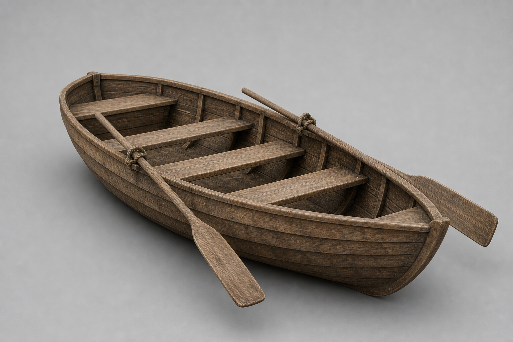

# Item Assets

- sword.glb https://www.fab.com/listings/5fe82d66-eaac-48e0-899d-1fedacdf409a
- spear.glb https://sketchfab.com/3d-models/spear-f13ddd24e2fe47aa8aca23487afd893e
- torch.glb https://sketchfab.com/3d-models/torch-stick-d8eadee1a5c14483aade99b1fe5bc150
- goblin_sword.glb https://sketchfab.com/3d-models/goblin-sword-5717ea55e34341b79efa692517e8598b
- shield_wooden.glb, shield_raven.glb https://sketchfab.com/3d-models/shield-323dfe4dbb764c439bcc6b0469f812eb
- leather_armor.glb — Meshy.ai (유료 생성, 2026-07-24, "Shadowbound Leather A"). 완전 소유권·상업 OK (characters.md License 참조)
    - 원화는 chatgpt 
- leather_pants.glb — Meshy.ai (유료 생성, 2026-07-24, "Leather Combat Pants"). 완전 소유권·상업 OK (characters.md License 참조)
- fishing_rod.glb — Meshy.ai (유료 생성, 2026-07-26, image-to-3D from the archived concept render). 완전 소유권·상업 OK (characters.md License 참조). Textures downscaled to 512², transform matched to spear.glb's hand-socket convention
    - 원화는 chatgpt 
- Fishing icons (10): fishing_rod.png, raw_minnow.png, raw_perch.png, raw_trout.png, river_salmon.png, golden_sturgeon.png, old_boot.png, clump_of_kelp.png, message_in_a_bottle.png, sunken_coin_pouch.png — ChatGPT image generation (2026-07-25, contributor-owned account), concept renders cut to 128×128 transparent icons
    - 원화: [rod](../images/fishing_rod.png) · [minnow](../images/raw_minnow.png) · [perch](../images/raw_perch.png) · [trout](../images/raw_trout.png) · [salmon](../images/river_salmon.png) · [sturgeon](../images/golden_sturgeon.png) · [boot](../images/old_boot.png) · [kelp](../images/clump_of_kelp.png) · [bottle](../images/message_in_a_bottle.png) · [pouch](../images/sunken_coin_pouch.png)
- rowboat.glb — Meshy.ai (유료 생성, 2026-07-29, image-to-3D from the archived concept render). 완전 소유권·상업 OK (characters.md License 참조). Textures downscaled to 1024², normalized to the 3.6 m hull footprint at load
    - 원화는 chatgpt 
- boat_deed.png — ChatGPT image generation (2026-07-29, contributor-owned account), concept render cut to a 128×128 transparent icon
    - 원화: [deed](../images/boat_deed.png)

