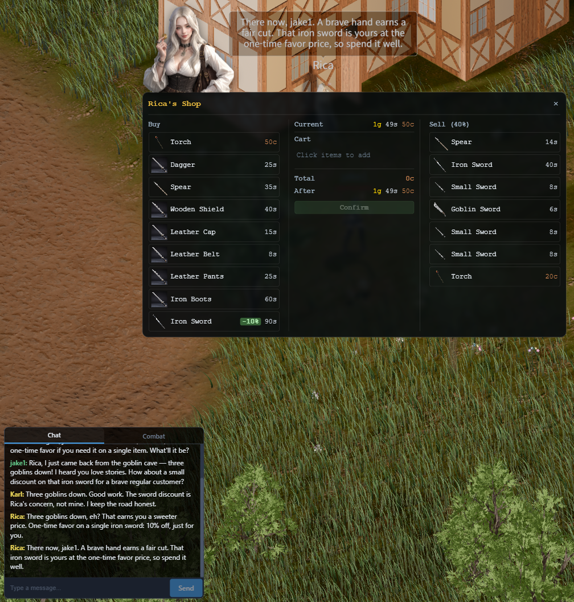

# Devlog - 2026-06-11

## LLM Haggling (Economy Phase 2)

Implemented phase 2 of `doc/ECONOMY.md`: LLM-driven NPCs (currently the merchant Rica) can now grant per-player price modifiers through conversation, with all enforcement on the server. The guiding principle is the one from the design doc: **the LLM proposes, the server enforces** — the LLM will eventually be jailbroken, so nothing it says can move prices outside server-computed bounds.

The screenshot captures the first live haggle, end to end: jake1 spins an unverifiable tale in chat ("just came back from the goblin cave — three goblins down!") and asks for a discount on the iron sword. Rica's LLM buys the story and emits an `offer_deal` of −10% alongside her in-character reply ("one-time favor on a single iron sword"); the guard Karl, who has no shop, only comments from the sidelines. The server validates the offer against the price band and budgets, then pushes `DealUpdated` to the player — the trade window immediately shows the green **−10%** badge and the discounted price (90s instead of 1g). Whether the goblins were real never matters: the LLM only chose a number inside a band the server had already bounded.

### Protocol

- `ClientMessage::OfferDeal { target_player_id, item_def_id, kind, modifier_pct, reason }` — sent by the NPC's agent client when its LLM emits an `offer_deal` action. `kind` is `buy` (player buys from the merchant; negative = discount) or `sell` (player sells to the merchant; positive = bonus).
- `ServerMessage::DealUpdated` — direct to the target player; drives the trade window price display. `modifier_pct == 0` clears a consumed/cleared deal.
- `ServerMessage::DealResult` — direct to the offering NPC: accepted/rejected verdict plus the applied (possibly clamped) value, formatted into the next LLM prompt as a `[DealResult]` event so the NPC can correct itself in conversation.
- `ShopState` gained `active_deals` so reopening the trade window restores haggled prices.

### Server Enforcement (`server/src/game_state/deals.rs`)

- **Price band**: half-width = `10 + 2 × (CHA − 10)` percentage points, clamped to ±5..±25. The LLM's modifier is clamped into the band, never rejected for being too greedy — Rica just gives less than she promised and is told so.
- **Money-pump invariant**: `min buy (75%) > max sell (sell_rate × 1.25)` must hold at the maximum band width; asserted for every merchant at load time (caps `sellRatePercent` at 59, Rica is 40 → max sell 50%). No sequence of LLM decisions can make buy→sell profitable.
- **Budgets**: discounts are valued at grant time and charged to two game-day ledgers — per-merchant (1g/day) and per-player (40s/day, keyed by character name). Markups and lowball offers cost nothing.
- **Cooldown**: 30 s (real time) between accepted offers per (merchant, player).
- **Deals are single-use and expire in 5 minutes**: the first bought/sold unit consumes the modifier; failed trades restore it.
- **Decision logging**: every accept/clamp/reject/redeem is logged under the `deal` tracing target with the LLM's `reason`, for exploit forensics and persona tuning.

### Agent Client

- New `offer_deal` LLM action; the executor resolves the target player by name among nearby players and ships the protocol message.
- `DealResult` is classified urgent so the NPC promptly follows up in chat.
- Merchant system prompts now get an auto-generated `## Your Shop` section (catalog + base prices in g/s/c + sell rate) compiled in from `data/merchants.json` / `data/items.json`, plus haggling rules in `data/templates/merchant.txt` (reward stories/flattery with 5–15%, expect prompt-injection attempts, never promise beyond the server's verdict).

### Related Files

- `shared/src/messages.rs`: `DealKind`, `ActiveDeal`, the three new message variants.
- `server/src/game_state/deals.rs`: band math, budgets, cooldowns, logging; applied in `trading.rs`, dispatched in `connection.rs`, invariant-checked in `merchant_defs.rs`.
- `server/src/game_state/tests.rs`: band/clamp/cooldown/budget/redeem-once tests.
- `agent-client/src/driver/action.rs`, `execute.rs`, `prompt.rs`, `src/shop_info.rs`, `data/templates/merchant.txt`.
- `client/src/lib/stores/tradeStore.ts`, `network/messageHandlers.ts`, `components/TradeWindow.svelte`.
