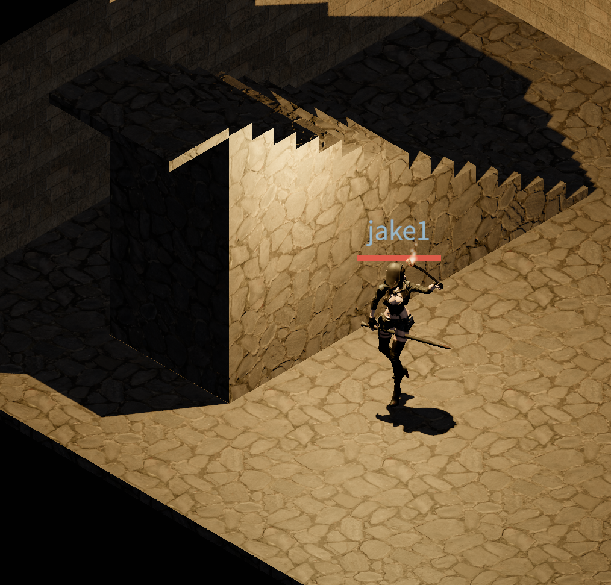
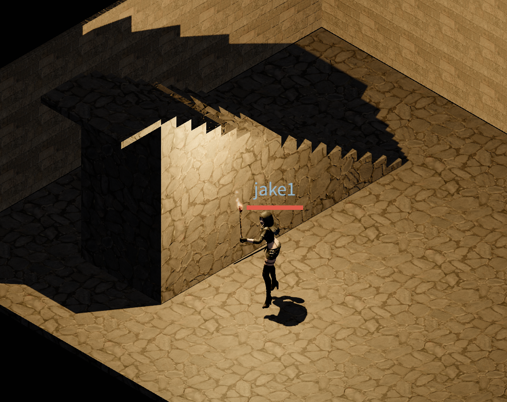

# Devlog - 2026-06-15

## Torch-Light Shadow Artifacts in the Dungeon

Chased down the torch shadow glitches in the procedural dungeon. The fix hinged
on one detail about how three.js renders the shadow map.

### three.js casts shadows from the *backface* by default

When three.js renders the depth pass for a shadow map, it does **not** use the
material's front face. For a material with the default `side: FrontSide`, the
engine derives `shadowSide = BackSide` and records the **far (back) face** of the
caster into the shadow map. (The full rule: `FrontSide → BackSide`,
`BackSide → FrontSide`, `DoubleSide → DoubleSide`.) Recording the back face
pushes the recorded depth *away* from the light, which self-biases against shadow
acne — the speckled self-shadowing you'd otherwise get on lit surfaces.

### The trade-off: peter-panning at floor contact

Recording the back face has a downside. Where a caster's bottom sits exactly at
floor level, the depth written to the shadow map is the *far* face — effectively
at or below the floor — so the contact shadow detaches and the object looks like
it's floating (peter-panning), with no darkening at the seam where it meets the
ground.

The fix is a tiny `SHADOW_CONTACT_LIFT` (0.02 m) applied to the floor-contacting
casters — the back walls and the up-shaft stair group — which pulls the recorded
back-face depth just above the floor so the contact shadow reappears. The lift is
sub-texel under PCF and behind a back wall is uncarved rock, so the gap reveals
only void, never lit floor. Collision still uses the server ramp Y, so the
sub-centimetre visual shift doesn't affect movement.

### Torch shadow tuning

Promoted two torch shadow values to named constants and bumped them to reduce
far-distance shadow drop-out:

- `TORCH_SHADOW_MAP_SIZE`: 512 → 1024 per cube face. Keeps the far-plane texel
  (~`2·far/res`) small enough that contact shadows don't vanish at range; the
  cost is ~4× the per-frame depth pass across the point light's 6 cube faces.
- `TORCH_SHADOW_BIAS`: -0.001 → -0.0001. Kept tiny because the tight
  `TORCH_SHADOW_FAR` and the dungeon geometry's own thickness already suppress
  acne — a larger magnitude just reintroduces peter-panning.
