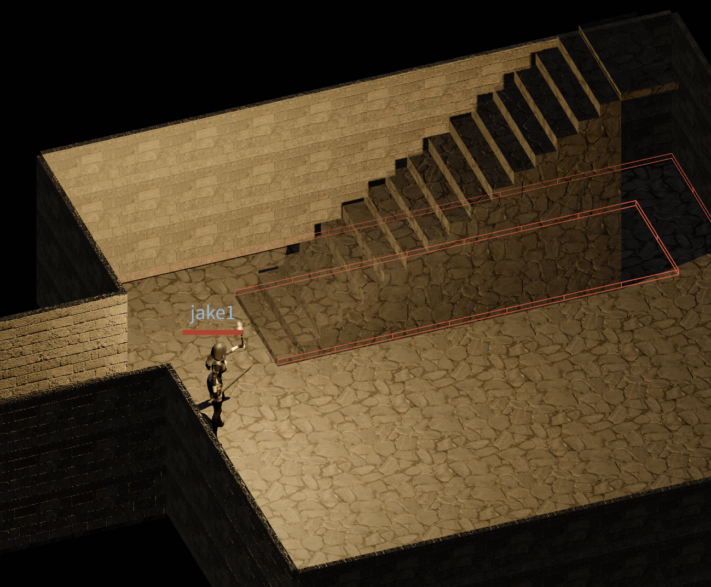
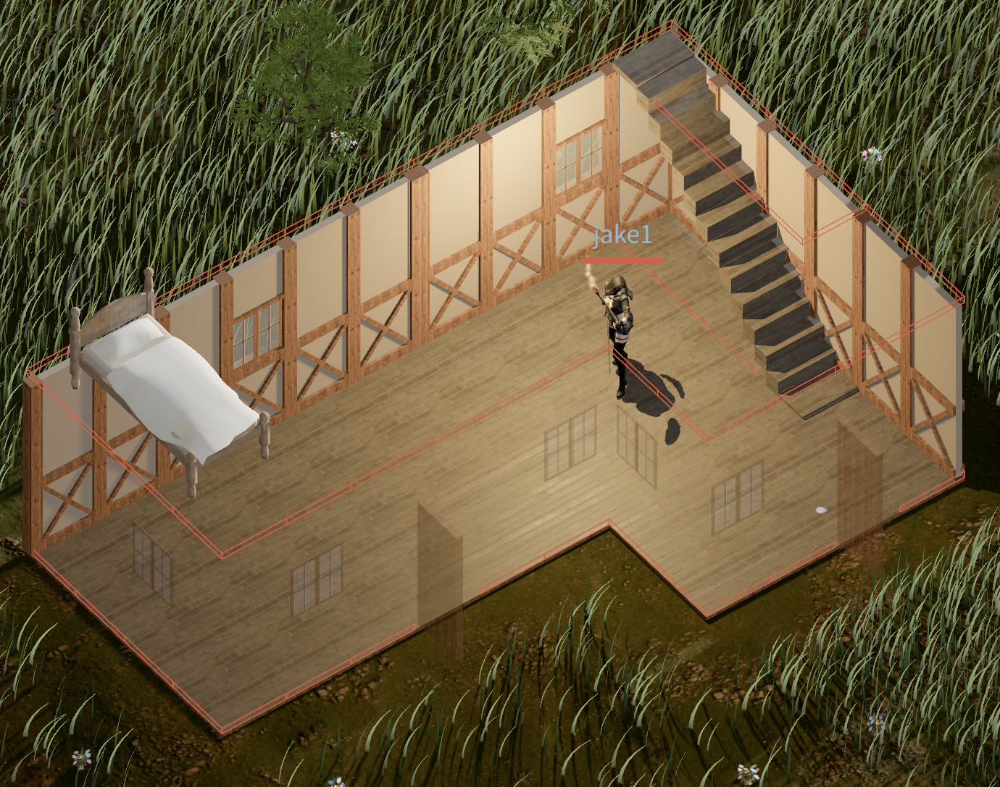

# Devlog - 2026-06-17

## Walling the Stair Shaft Against Same-Floor Monsters

Dungeon monsters kept marching up the stairs and clipping through the walls of
the floor above. The visible symptom: a monster confined to the current floor
would step onto the stair run and render at the *adjacent* floor's height, since
the steps physically span both levels.

### Root cause: the shaft footprint is a passable cut-through

Each stair shaft sits inside a wrapping room. The old passability grid walled
the lateral sides of the shaft but left the far landing's room-facing run-end
**open**, so same-floor A* happily treated the shaft as a shortcut across the
room and walked monsters straight onto the steps.

The fix blocks those passability flags so monsters on the current floor can no
longer enter the high side of the stairs. The new `wall_shaft` closure seals the
far landing's run-end (the top landing for the up-shaft, the bottom landing for
the down-shaft) while leaving the steps along the run open — so a *descending*
player, collision-checked against this floor only once their Y drops into its
range, can still walk through. The exit landing stays open sideways so the
player can step off at the bottom.

### The red band is a passability debug overlay



The red band drawn over the upper stair run in the screenshot is **not** a
gameplay element — it's a debug visualization of the passability grid, marking
the cells now flagged impassable. With those cells blocked, A* refuses to route
current-floor monsters onto the high side of the stairs, while the player
(standing on the still-open exit landing at the bottom) is unaffected.

Toggle the overlay from the browser DevTools console:

```js
window.__togglePassability()
```

### Housing uses the same mechanism

What matters here is the stair-sealing rule itself, and that rule isn't
dungeon-specific — player housing reuses it unchanged. The high side of a
staircase is walled off in the passability grid so the lower floor can't route
into it: a character on the ground floor can't step up onto the elevated run,
and stays confined to its own floor until it actually climbs the stairs. It's
the same fix that stops dungeon monsters from clipping through the floor above.

The red wireframe below is just how that rule is *visualized*: it traces the
blocked cell edges along the walls and the staircase. The blocking is the point;
the overlay only confirms it.



