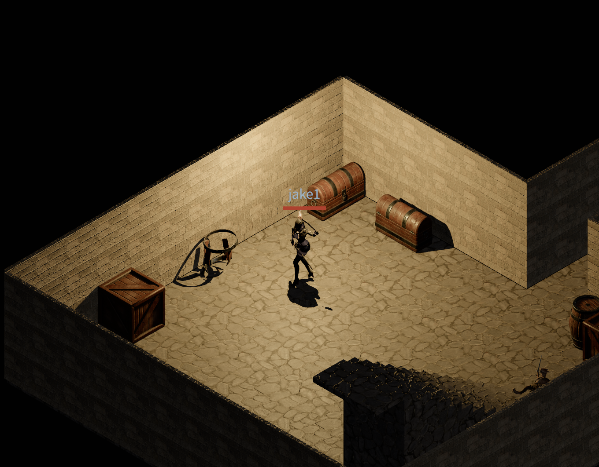

# Devlog - 2026-06-18

## Smashing Dungeon Props

Yesterday's dungeon dressing — the barrels and crates from the FPS Dungeon
Extras pack — went in as solid, immovable clutter. Today they become
*breakable*. Click a barrel or a crate and the player walks up to it, takes one
sword swing, and the whole-model prop is replaced with its broken-debris variant
at the contact frame: a barrel collapses into staves, a crate bursts into
pieces. Chests stay intact — they're loot containers, not target practice.

### Walk up, then swing

Breaking isn't instant. The click first runs a `break_prop` raycast pass to
identify which prop was hit, then files a *pending break* as a walk-up intent.
The player paths to the prop, and only once proximity is satisfied does the
dungeon layer fire the actual break — a one-shot sword swing that reuses the
existing `attack` FSM state. The model swaps to its broken clone (built by a
shared `buildBrokenClone` helper) on the swing's contact frame, so the hit reads
as the cause of the smash.

### Server-authoritative, floor-gated

Breaking is synced so everyone in the room sees the same wreckage:

- The server tracks smashed props in `DungeonRuntime.broken_props` and validates
  each request for floor, proximity, and kind before accepting it.
- Confirmed breaks broadcast as `DungeonPropBroken` to nearby players through
  the floor-gated AOI, so a barrel smashed on B3 never leaks to players on B2.
- On floor entry the server sends a `DungeonPropsState` snapshot, so a late or
  re-entering player arrives to the room in its current broken state.

State is in-memory only and resets on server restart, matching how chest
cooldowns already behave.

### The smashed cell becomes walkable

A whole barrel is solid and blocks its tile; once it's debris you should be able
to walk over it. A new `dungeon_apply_broken_props` wasm binding rebuilds the
floor's passability cache by recomputing from the carved mask — so the broken
prop's cell opens up while any wall the prop was sitting against stays blocked.

### A platform-dependent RNG bug, found and fixed

Getting break validation to work surfaced a subtle desync: dungeon generation
drew prop and spawn cells with `gen_range(0..slice.len())`. On wasm32 `usize` is
32-bit, but on native it's 64-bit, so the RNG consumed a different number of
bytes per platform and the client (wasm) and server (native) ended up
disagreeing on *which* cells held props. The server then rejected legitimate
break requests as "too far." Both call sites now draw a fixed-width `u32`, and
the golden-layout-hash test was re-blessed against the corrected layout.
