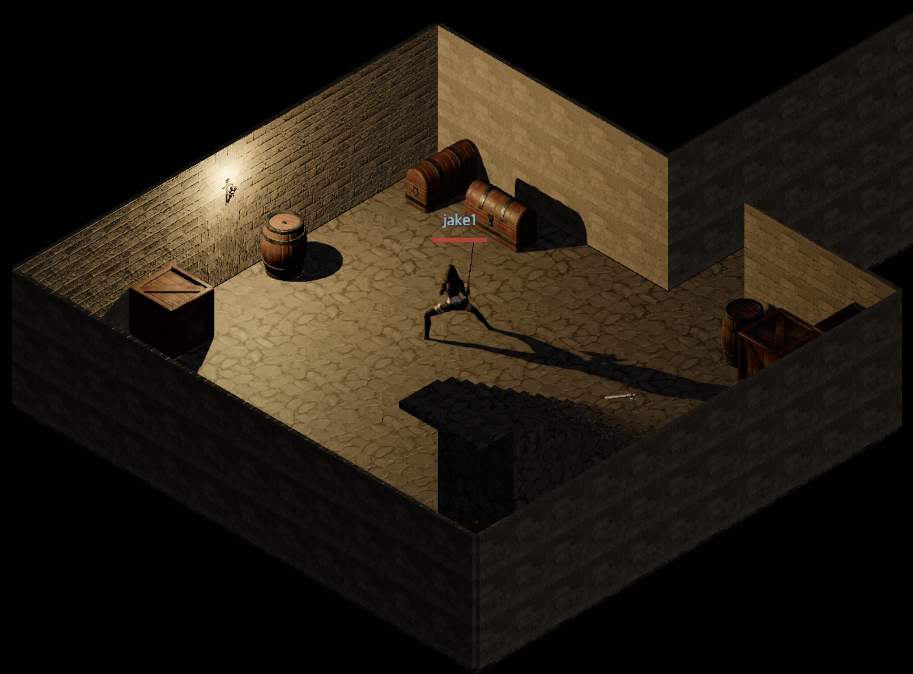

# Devlog - 2026-06-23

## Wall Torches in the Dungeon

To make the dungeon feel more like an actual dungeon, I added wall torches.
Each eligible room can get at most one torch, hung at
the centre of its north or east wall (the side picked at random).

The torch is a new `torch_wall` object in the model catalog. It hangs high on
the wall rather than sitting on the floor, with the mount's back face flush
against the wall surface. The model comes from
[this torch on Sketchfab](https://sketchfab.com/3d-models/torch-238cd6056e2940debb4f67fc24c6df35).

On top of the model I wired up actual lighting: each torch's flame position is
read every frame and fed a flickering point light, so the flame casts a warm,
unsteady glow on the surrounding stone. The flicker and shadow casting are gated
behind the graphics preset (`enableTorchEffects` / `enableTorchShadows`) so the
effect can be scaled down on lower-end machines.

For performance there is only a single shadow-casting point light. The wall
torches cast a shadow only when the player has not lit their own torch — in that
case the one shadow light relocates to the nearest wall torch. As soon as the
player lights a torch, the shadow light follows the player instead, and the wall
torches fall back to a plain shadowless glow.

The reason it works this way is that toggling a light's shadow casting on and
off (or adding/removing lights from the scene) forces three.js to recompile
every material's shaders, which causes a multi-second stall. To avoid that I
pool the lights: a fixed number of point lights is mounted once and never
churns. Each frame the pool's lights are simply re-parked on the nearest wall
torches and their intensity is faded in or out, so the light count — and the
shadow setup — stays constant and no recompilation is triggered.
