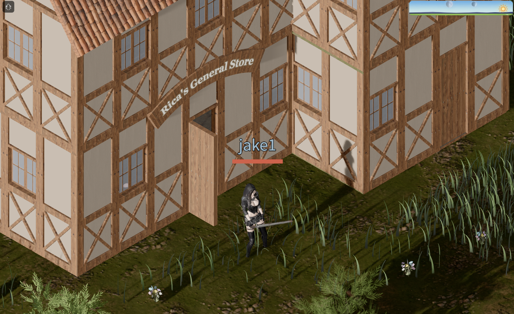

# Devlog - 2026-07-14

## Dressing Up Rica's Shop

Rica's store finally looks like a store.

Hung a procedural shop sign — a curved board reading **"Rica's General
Store"** — over the entrance so it reads as a shop from outside.

Item models can now be placed as furniture, so I dressed the interior with the
goods themselves: potions, blades, and scrolls laid out on the tables.

And to match the decor, Rica now stocks **Healing Potions** and **Scrolls of
Return**.
