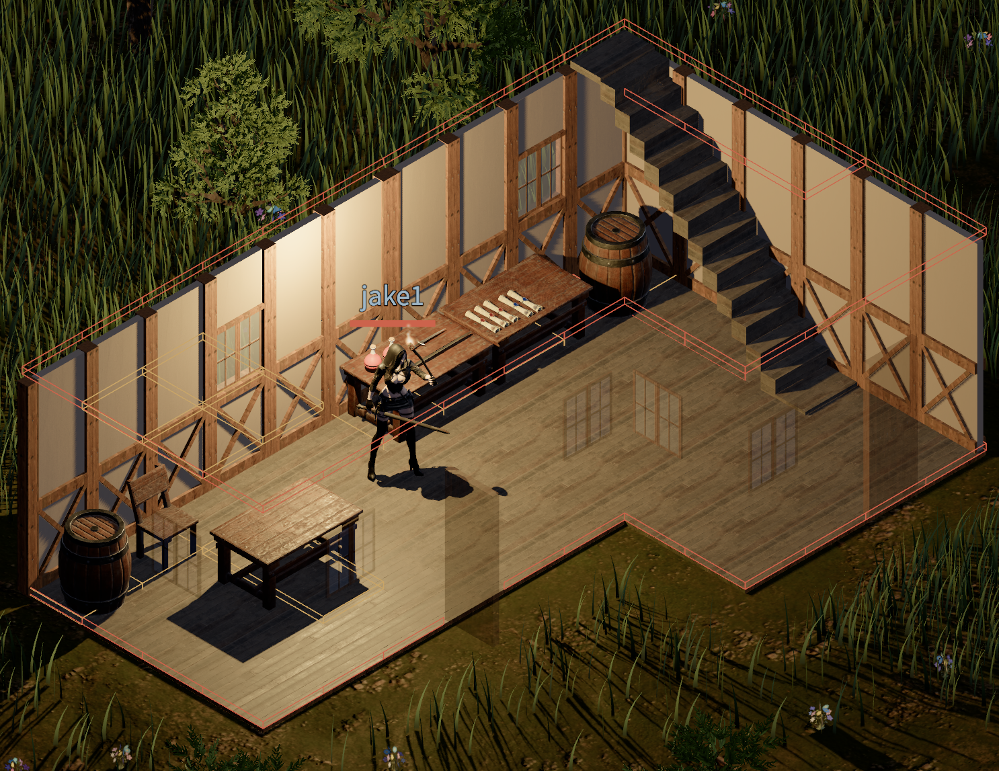

# Devlog - 2026-07-16

## Solid Furniture Blocks Movement

Furniture you place now blocks movement. Tables, barrels, and chairs seal off
the tiles they sit on, so players and NPCs walk around them instead of through
them.

The collision logic is shared Rust, so the browser, bots, and server all agree
on which tiles are blocked. The orange outlines in the screenshot are a
`/passability` debug overlay, not a gameplay element.
